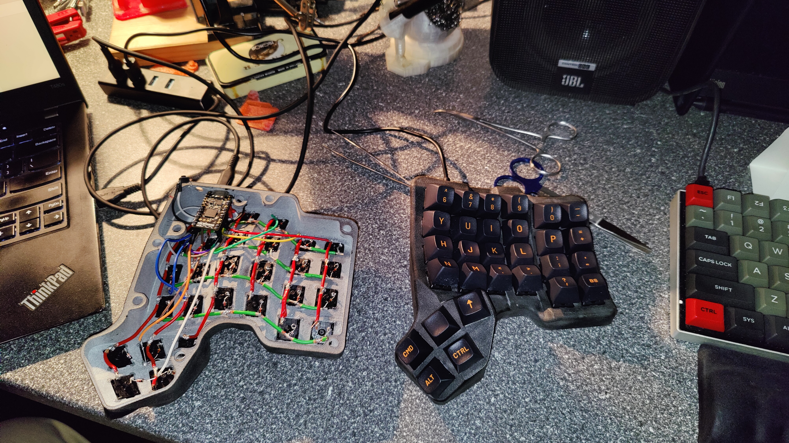

# zmk-config
This is the ZMK-Config repo for my [Scylla](https://bastardkb.com/scylla) by [Bastard Keyboards](https://bastardkb.com).

## Scylla

The board is based on [open sourced files](https://github.com/Bastardkb/Scylla) and is handwired. 3D Printed with MJF method, surfaced melted with blowtorch, Cherry MX Brown switches.

The [nice!nano](https://nicekeyboards.com/nice-nano/) is attached with [a promicro/scylla mount](https://github.com/Bastardkb/Skeletyl/tree/main/things/pro%20micro%20mount%20plate). 

ZMK firmware details within this repo. 

## Keymap Editor
https://nickcoutsos.github.io/keymap-editor/